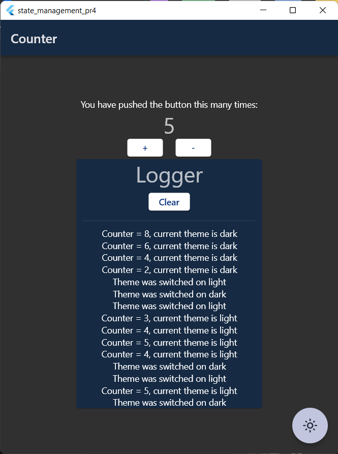

# Практическая работа №4

## Тема: Cubit.

### Цель работы: в ходе выполнения практической работы реализовать кликер со списком нажатий, с использованием Cubit.

__1. Подключение библиотеки__

В файле `pubspec.yaml` подключим библиотеку `flutter_bloc: ^8.1.1` для работы с _Cubit_ и _Bloc_.

__2. Создание cubit для смены темы приложения__

В папке `cubit/theme_cubit` создадим файлы для работы с _cubit_.
В файле `theme_state.dart` создадим два дочерних класса состояния:

```dart
@immutable
abstract class ThemeState {}

class LightThemeState extends ThemeState {}

class DarkThemeState extends ThemeState {}
```

Теперь в файле `theme_cubit.dart` напишем метод, который будет менять тему приложения:

```dart
class ThemeCubit extends Cubit<ThemeState> {
  ThemeCubit() : super(LightThemeState());
  ThemeMode themeMode = ThemeMode.light;

  void switchTheme() {
    if (themeMode == ThemeMode.light) {
      themeMode = ThemeMode.dark;
      emit(DarkThemeState());
    } else {
      themeMode = ThemeMode.light;
      emit(LightThemeState());
    }
  }
}
```

__3. Создание cubit для кликера__

В папке `cubit/click_cubit` создадим файлы для работы с _cubit_.
В файле `click_state.dart` создадим два дочерних класса состояния:

```dart
@immutable
abstract class ClickState {}

class ClickInitial extends ClickState {}

class ClickError extends ClickState {
  final String message;

  ClickError({required this.message});
}

class Click extends ClickState {
  final int count;

  Click(this.count);
}
```

Теперь в файле `theme_cubit.dart` напишем необходимые методы.
Для начала создадим переменные:

- `count` - количество нажатий;
- `widgetsList`- список строковых значений, которые будут выводиться в логгере;
- `_textMessage` - сообщение которое будет выводиться, когда счетчикбудет равен 10;

```dart

int count = 0;
List<String> widgetsList = <String>[];
static const String _textMessage = 'Counter equals 10!';
```

Теперь напишем метод, который будет вызываться при клике на кнопку '+'.
Здесь мы будем принимать на вход текущую тему
и в зависимости от темы прибавлять нужное количество к переменной счетчика,
и будем добавлять в список логгера значение переменной `counter` и текущую тему:

```dart
void onIncClick(ThemeMode theme) {
  theme == ThemeMode.light ? count++ : count += 2;
  if (count == 10) {
    emit(ClickError(message: _textMessage));
    widgetsList.add(_textMessage);
    count = 0;
    return;
  }
  emit(Click(count));
  widgetsList
      .add('Counter = ${count.toString()}, current theme is ${theme.name}');
}
```

Теперь напишем аналогичный метод нажатия на кнопку '-':

```dart
void onDecClick(ThemeMode theme) {
  theme == ThemeMode.light ? count-- : count += -2;
  if (count == 10) {
    emit(ClickError(message: _textMessage));
    widgetsList.add(_textMessage);
    count = 0;
    return;
  }
  widgetsList
      .add('Counter = ${count.toString()}, current theme is ${theme.name}');
  emit(Click(count));
}
```

Теперь напишем метод для добавления в список логов названия темы, который будет вызываться при смене темы:

```dart
void getThemeName(BuildContext context) {
  widgetsList.add(
      'Theme was switched on ${context
          .read<ThemeCubit>()
          .themeMode
          .name}');
}
```

И метод для очищения списка логов:

```dart
void clearLog() {
  widgetsList.clear();
  emit(ClickError(message: count.toString()));
}
```

__4. Создание экрана__
Для начала виджет `MaterialApp` обернем в `BlocBuilder`,
а его обернем в `MultiBlocProvider`:

```dart
class MyApp extends StatelessWidget {
  const MyApp({super.key});

  @override
  Widget build(BuildContext context) {
    return MultiBlocProvider(
      providers: [
        BlocProvider(create: (context) => ClickCubit()),
        BlocProvider(create: (context) => ThemeCubit()),
      ],
      child: BlocBuilder<ThemeCubit, ThemeState>(builder: (context, state) {
        return MaterialApp(
          debugShowCheckedModeBanner: false,
          title: 'State management',
          themeMode: context
              .read<ThemeCubit>()
              .themeMode,
          theme: ThemeData(colorScheme: lightColorScheme),
          darkTheme: ThemeData(colorScheme: darkColorScheme),
          home: const CounterPage(),
        );
      }),
    );
  }
}
```

Теперь используя контекст приложения мы можем пользоваться нашими кубитами.

В классе `CounterPage()` обернем виджет `Text`, в котором у нас будет
выводиться значение счетчика, виджетом `BlocBuilder`,
чтобы мы могли его перерисовывать без перерисовки всего экрана:

```dart
BlocBuilder<ClickCubit, ClickState>(
  builder: (context, state) {
    if (state is ClickError) {
      return Text(
      state.message,
      style: Theme.of(context).textTheme.headline4,
      );
    }
    if (state is Click) {
      return Text(
      state.count.toString(),
      style: Theme.of(context).textTheme.headline4,
      );
    }
    return Text(
      '0',
      style: Theme.of(context).textTheme.headline4,
    );
  },
),
```
Теперь создадим две кнопки, в которых бедм вызывать методы добавления и убавления счетчика.
Пример кнопки добавления значения:
```dart
ElevatedButton(
  onPressed: () {
    context
        .read<ClickCubit>()
        .onIncClick(context.read<ThemeCubit>().themeMode);
    },
  child: const Text('+'),
),
```

Теперь создадим `ListView` для вывода логов:
```dart
Expanded(
  child: BlocBuilder<ClickCubit, ClickState>(
    builder: (context, state) {
      return ListView.builder(
        physics: const BouncingScrollPhysics(),
        itemBuilder: (context, index) {
          return Center(
            child: Text(context
                .read<ClickCubit>()
                .widgetsList[index]),
          );
        },
        itemCount:
            context.read<ClickCubit>().widgetsList.length,
      );
    },
  ),
),
```

Создадим кнопку для смены темы:
```dart
floatingActionButton: BlocBuilder<ThemeCubit, ThemeState>(
  builder: (context, state) {
    return FloatingActionButton(
      onPressed: () {
         context.read<ThemeCubit>().switchTheme();
         context.read<ClickCubit>().getThemeName(context);
      },
      tooltip: 'Switch theme',
      child: Icon(state is LightThemeState
           ? Icons.dark_mode_outlined
           : Icons.light_mode_outlined),
    );
  },
),
```

__5. Результат__


### Вывод: в ходе выполнения практической работы был реализован кликер с выводом логов о нажатии и смены темы.